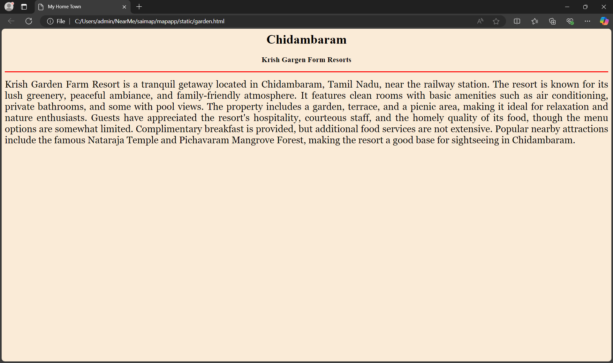

# Ex04 Places Around Me
## Date: 03.12.2024

## AIM
To develop a website to display details about the places around my house.

## DESIGN STEPS

### STEP 1
Create a Django admin interface.

### STEP 2
Download your city map from Google.

### STEP 3
Using ```<map>``` tag name the map.

### STEP 4
Create clickable regions in the image using ```<area>``` tag.

### STEP 5
Write HTML programs for all the regions identified.

### STEP 6
Execute the programs and publish them.

## CODE
```
map.html 

<html>
<head>
<title>My City</title>    
</head>  
<body>
<h1 align="center">
<font colour="red"><b>Chidambaram</b></font>
</h1>
<h3 align="center">
<font colour="blue"><b> Samritha R (24013637)</b></font>
</h3>
<center>

<map name="MyCity">
<area shape="rect" coords="500,300,900" href="home.html" title="My Home Town">  
<area shape="circle" coords="570,230,80" href="temple.html" title="Thillai Natarajar Temple">
<area shape="circle" coords="640,200,300" href="forest.html" title="Pichavaram Mangrove Forest">
<area shape="circle" coords="1120,360,900" href="garden.html" title="Krish Garden Farm Resorts">
<area shape="circle" coords="150,120,1100" href="beach.html" title="Kodiyampalayam Beach">  
</map>
</center>
</body>  
</html>

temple.html

<html>
<head>
<title>My Home Town</title>
</head>
<body bgcolor="white">
<h1 align="center">
<font color="brown"><b>Chidambaram</b></font>
</h1>
<h3 align="center">
<font color="brown"><b>Thillai Natarajar Temple</b></font>
</h3>
<hr size="3" color="red">
<p align="justify">
<font face="Georgia" size="5">
Lord Nataraja,also known as the "Lord of Dance", is a form of the Hindu god Shiva. Nataraja is one of the most iconic depictions of Shiva 
and represents his cosmic dance, which symbolizes the rhythm of the universe and continuous cycles of creation,preservation, and destruction.
In the Nataraja form, Lord Shiva is shown dancing within a circle of flames the represents the eternal cycle of time. He stands on one leg, 
with the other raised in a pose the suggests dynamic movement. His many arms depict various symbolic gesture, each having specific meanings.
</font>
</p>
</body>
</html>

forest.html

<html>
<head>
<title>My Home Town</title>    
</head>
<body bgcolor="green">
<h1 align="center">
<font color="pink"><b>Chidambaram</b></font>
</h1>
<h2 align="center">
<font color="pink"><b> Pichavaram Mangrove Forest</b></font>
</h2>
<hr size="3" color="red">
<p align="justify">
<font face="Georgia" size="5">
Mangrove forests are coastal ecosystems found in tropical and subtropical regions, characterized by salt-tolerant trees and shrubs 
known as mangroves. These forests are typically found along sheltered shorelines, where the land meets the sea, in areas with high 
tidal influence. Mangroves are unique because they thrive in brackish water, where freshwater meets seawater, and are well-adapted 
to withstand harsh conditions such as saltwater, strong waves, and anoxic (low oxygen) soils. Mangrove trees have specialized root 
systems, such as prop roots and pneumatophores, that allow them to stay anchored in soft, waterlogged soil while also obtaining oxygen.
</font> 
</p> 
</h3>
</html>

beach.html

<html>
<head>
<title>My Home Town</title>    
</head>
<body bgcolor="sky">
<h1 align="center">
<font color="white"><b>Chidambaram</b></font>
</h1>
<h3 align="center">
<font color="white"><b>Kodiyampalayam Beach</b></font>
</h3>
<hr size="3" color="white">
<p align="justify">
<font color="white" face="Georgia" size="5">
Kodiyampalayam Beach is a tranquil and unspoiled coastal destination along the Bay of Bengal. Known for its serene atmosphere, 
it offers a peaceful retreat away from the bustling crowds. The beach is close to fishing villages, where visitors can experience 
the traditional lifestyle of fishermen. Additionally, its proximity to the Pichavaram Mangroves adds to its charm, making it an excellent 
spot for nature lovers and those seeking scenic beauty and relaxation.
</font> 
</p> 
</h3>
</html>

garden.html

<html>
<head>
<title>My Home Town</title>    
</head>
<body bgcolor="antiquewhite">
<h1 align="center">
<font color="black"><b>Chidambaram</b></font>
</h1>
<h3 align="center">
<font color="black"><b>Krish Gargen Form Resorts</b></font>
</h3>
<hr size="3" color="red">
<p align="justify">
<font face="Georgia" size="5">
Krish Garden Farm Resort is a tranquil getaway located in Chidambaram, Tamil Nadu, near the railway station. The resort is known for its lush
greenery, peaceful ambiance, and family-friendly atmosphere. It features clean rooms with basic amenities such as air conditioning, private 
bathrooms, and some with pool views. The property includes a garden, terrace, and a picnic area, making it ideal for relaxation and nature 
enthusiasts. Guests have appreciated the resort's hospitality, courteous staff, and the homely quality of its food, though the menu options 
are somewhat limited. Complimentary breakfast is provided, but additional food services are not extensive. Popular nearby attractions include 
the famous Nataraja Temple and Pichavaram Mangrove Forest, making the resort a good base for sightseeing in Chidambaram.
</font> 
</p> 
</h3>
</html>

home.html

<html>
<head>
<title>My Home Town</title>    
</head>
<body bgcolor="pink">
<h1 align="center">
<font color="white"><b>Chidambaram</b></font>
</h1>
<h3 align="center">
<font color="white"><b>My Home Town</b></font>
</h3>
<hr size="3" color="white">
<p align="justify">
<font color="black" face="Georgia" size="5">
Chidambaram Toen is located in Cuddalore district of Tamil Nadu, India. It is most famous for the nataraja Temple.
It lies on the fertile plains close to the Bay of Bengal and is situated about 15 kilometers west of the coastline.
It surrounds by lush greenery abd is a significant center for religious tourism. Historically, The area around Chidambaram
was a Thillai forest, dominated by mangrove. Chidambaram is also home to Annamalai University, a prominent educational institution 
offering a wide range of academic and reserch opportunities.
</font> 
</p> 
</h3>
</html>
```


## OUTPUT





## RESULT
The program for implementing image maps using HTML is executed successfully.
